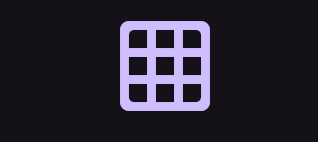
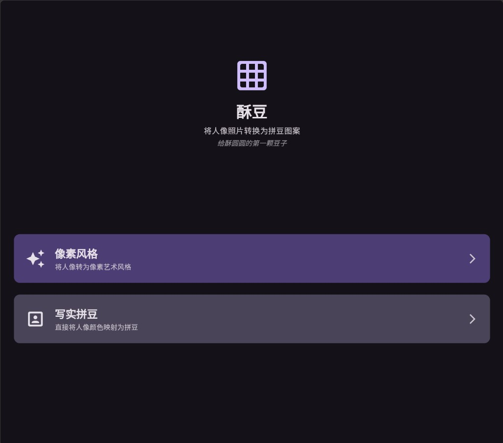
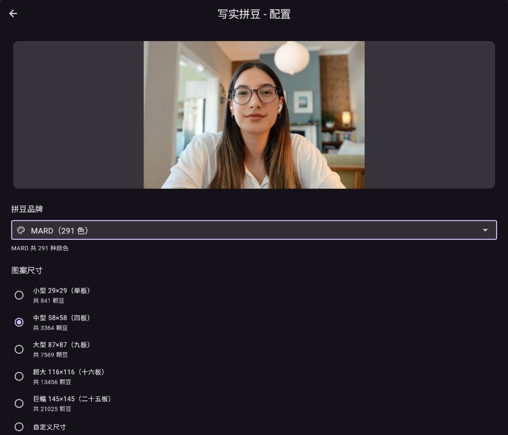
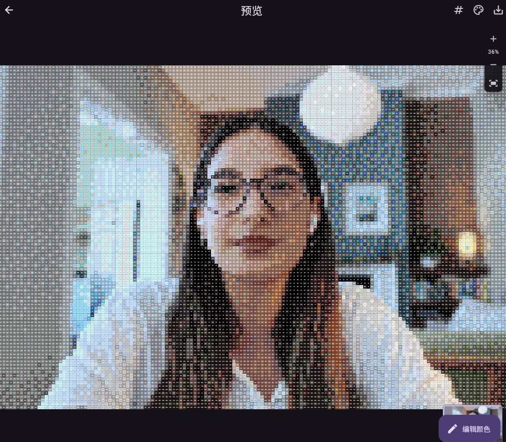

<p align="center">
  
</p>

<h1 align="center">酥豆 · Fuse Beads</h1>

<p align="center">
  <b>把任意照片变成可以直接动手拼的拼豆图纸</b><br>
  开源的拼豆图案生成器，告别手动数格子
</p>

<p align="center">
  
  
  
  
</p>

<p align="center">
  
  
  
</p>

---

## 30 秒跑起来

```bash
git clone https://github.com/Xinghuo-WorldModel/Fuse-Beads.git
cd Fuse-Beads
flutter pub get
flutter run -d edge        # Web
flutter run -d windows     # 桌面
flutter build apk --release  # Android
```

---

## 核心亮点

| | 特性 | 说明 |
|---|---|---|
| 🎨 | 7 大品牌色板 | Perler / Hama / Artkal-C / Artkal-R / MARD / Yant / Nabbi，共 600+ 种颜色 |
| 🧠 | CIEDE2000 配色 | 比 RGB 距离精准 3 倍，匹配结果更接近人眼感知 |
| ✨ | K-Means++ 调色板 | 智能挑选最优颜色子集，减少浪费 |
| 🖼️ | 两种风格 | 像素艺术风 / 写实照片风，一键切换 |
| 📐 | 任意尺寸 | 从 29×29 单板到 300×300 巨幅，支持自定义 |
| ✏️ | 交互编辑 | 点击任意豆子修改颜色，实时预览 |
| 📤 | 一键导出 | 高清 PNG 带网格线 + 色号 + 用色统计，Android 直存相册 |

---

## 为什么用酥豆？

| 痛点 | 其他工具 | 酥豆 |
|------|---------|------|
| 颜色不准 | RGB 直接匹配，色差大 | CIEDE2000 + 抖动算法，丝滑过渡 |
| 品牌少 | 只支持 1-2 个品牌 | 7 大品牌全覆盖 |
| 不能改 | 生成后不可编辑 | 点哪改哪，实时生效 |
| 肤色崩 | 人脸区域马赛克感重 | 肤色优先策略，降低抖动保持自然 |
| 只能手机 | 仅 App | Android + Web + Windows 全平台 |

---

## 核心算法

- **CIEDE2000** — 工业级色差公式
- **K-Means++ 聚类** — 从品牌色板中挑出最优 N 色
- **蛇形 Floyd-Steinberg 抖动** — 消除色带，平滑渐变
- **自动白平衡 + CLAHE** — 修正偏色、提升暗部细节
- **肤色检测** — 皮肤区域降低抖动强度

---

## 项目结构

```
lib/
├── models/          # 数据模型
├── data/            # 品牌色板加载
├── services/        # 图像处理 / 颜色匹配 / 导出
├── screens/         # 首页 / 配置 / 预览
└── widgets/         # 网格绘制 / 调色板 / 颜色选择器
```

---

## 参与贡献

欢迎 PR 和 Issue！特别欢迎：
- 新增品牌色板数据
- 优化颜色匹配算法
- 多语言支持

---

## License

MIT

---

<p align="center"><i>给酥圆圆的第一颗豆子</i></p>
